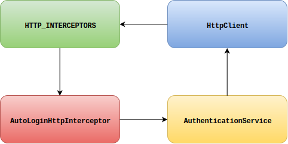

# Fork your HTTP client: supporting non-global HTTP interceptors in Angular

Most AngularJS developers are probably familiar with the concept of [HTTP interceptors](https://docs.angularjs.org/api/ng/service/$http): a mechanism for modifying request and responses.
This feature is commonly used for tasks such as global authentication, logging and error handling.

When Angular 2 was introduced it became clear there (initially) would be [no equivalent for HTTP interceptors](https://github.com/angular/angular/issues/2684).
In order to support similar functionality in Angular 2 you had to create your own HTTP service which took care of intercepting the request and responses.
While that approach worked fine, it was not a very convenient one.
Alternatively you could have used a third party Angular library to bring back HTTP interceptor support.

With the release of Angular 4.3 the new `HttpClient` was introduced, which deprecated the `Http` service.
Apart from a much improved API the new HTTP client also brought back the beloved HTTP interceptors.
So, everything is good now... right?

## The problem with Angular's HTTP interceptors

While we can be happy about the fact that the interceptors are supported again, I feel like the Angular core team fell into the same trap as in AngularJS: the interceptors are global!
Before looking at a (possible) solution, first let's see what does it mean for an interceptor to be global and why global interceptors can be a problem.

If you take a look at the official documentation for Angular's `HttpClient` you'll find a section called '[_Intercepting **all** requests or responses_](https://angular.io/guide/http#intercepting-all-requests-or-responses)', that describes how to use HTTP interceptors.
Notice that the word **_all_** has been highlighted; that is what is meant with global interceptors.
Whenever you define a HTTP interceptor it will intercept all requests and responses.
For many application that presumably is not a problem, however there are enough cases in which this is not desirable.

A common case in which the global HTTP interceptors actually become a problem is when your application uses several different and unrelated API's.
These API's probably require different authentication and error handling.
With global interceptors, these interceptors need to be aware that they might possibly intercept messages which they should ignore.
For example if you have created an authentication interceptor for API **X**, then it is not correct if it also sets an authentication header for requests that target API **Y**.

This is often solved in HTTP interceptors by explicitly checking the URL of the messages to determine which ones should be ignored.
Although that works, it is not a very elegant solution as it clutters the interceptor with additional logic.
Also, often the exact URLs of the API endpoints are not known in advance.
Maybe the application is deployed in different environments or the interceptor could be part of an isolated reusable module.
In those situations the URLs are not known in advance and you need to implement a mechanism to provide this information from outside of the interceptor.

Another problem that can occur with global HTTP interceptors is that it can lead to circular dependencies.
Recently I encountered such a situation when developing an interceptor that automatically would redirect the user to login screen of a single sign on service.
The interceptor made use of an authentication service, that in turn had a dependency on `HttpClient`.
A simplified dependency graph of the situation is shown below.

